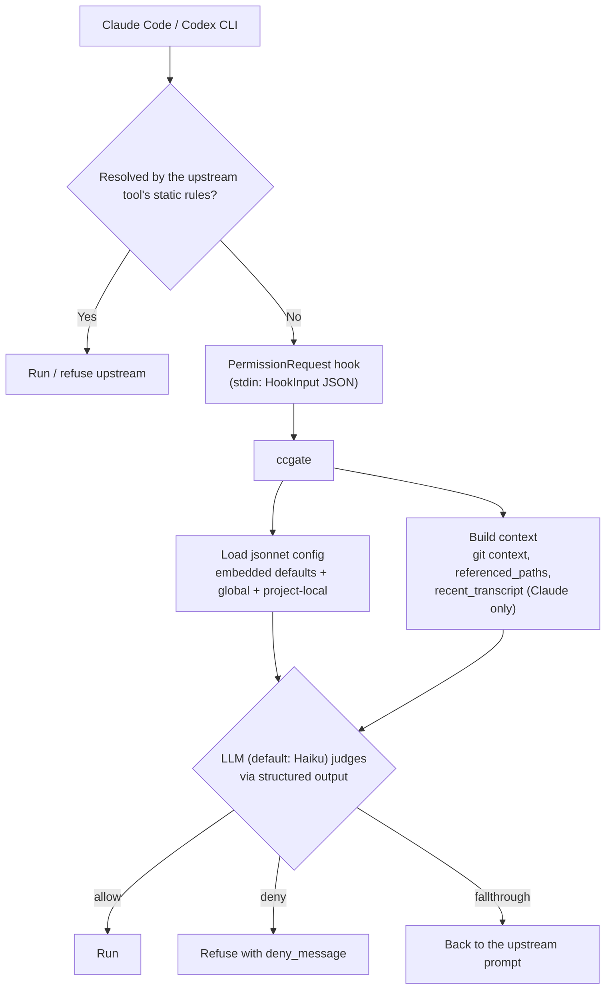

# ccgate

[](https://github.com/tak848/ccgate/actions/workflows/ci.yml)
[](https://github.com/tak848/ccgate/releases)

A **PermissionRequest** hook for AI coding tools. It delegates each tool-execution permission decision to an LLM (Claude Haiku) using rules written in a jsonnet configuration file.

ccgate ships with built-in default rules, so it works out of the box without any configuration.


Supported targets:

- **[Claude Code](https://docs.anthropic.com/en/docs/claude-code)**
- **[OpenAI Codex CLI](https://developers.openai.com/codex/hooks)**

[日本語ドキュメント](docs/ja/README.md)

## Install

### mise (recommended)

Requires mise `2026.4.20` or later.

```bash
mise use -g aqua:tak848/ccgate
```

To try ccgate without installing it globally (similar to `npx` / `uvx`):

```bash
mise exec aqua:tak848/ccgate -- ccgate --version
```

### aqua

Via the [aqua](https://aquaproj.github.io/) standard registry (requires registry `v4.498.0` or later). In an aqua-managed project (run `aqua init` first if you don't have an `aqua.yaml` yet):

```bash
aqua g -i tak848/ccgate
aqua i
```

For a [global aqua config](https://aquaproj.github.io/docs/tutorial/global-config), follow aqua's own tutorial.

### go install

```bash
go install github.com/tak848/ccgate@latest
```

### GitHub Releases

Download a binary from [Releases](https://github.com/tak848/ccgate/releases) and place it on your `PATH`.

### Homebrew

```bash
brew install tak848/tap/ccgate
```

## Quick start — Claude Code

### 1. Register as a Claude Code hook

`~/.claude/settings.json`:

```json
{
  "hooks": {
    "PermissionRequest": [
      {
        "matcher": "",
        "hooks": [
          {
            "type": "command",
            "command": "ccgate claude"
          }
        ]
      }
    ]
  }
}
```

`"command": "ccgate"` (no subcommand) is the canonical Claude Code hook invocation; `ccgate claude` is the explicit form.

If `ccgate` is not on your `PATH` (e.g. when relying on `mise exec` instead of a global install), set the hook `command` to the equivalent invocation, or use an absolute path to the binary.

### 2. API key

ccgate calls Anthropic's Claude Haiku by default. Export `CCGATE_ANTHROPIC_API_KEY` (or `ANTHROPIC_API_KEY` as fallback). For OpenAI / Gemini and the resolution order, see [docs/providers.md#api-keys](docs/providers.md#api-keys).

That's it — ccgate is now running with its embedded defaults. To customize what is allowed or denied, see [docs/rule-tuning.md](docs/rule-tuning.md); for background on how rules work, see [Concepts](#concepts).

## Quick start — Codex CLI

> [!NOTE]
> Codex hooks require `[features] codex_hooks = true` in `~/.codex/config.toml`. See [docs/codex-cli.md](docs/codex-cli.md) for details.

### 1. Register as a Codex hook

Codex reads hooks from `~/.codex/hooks.json` and `~/.codex/config.toml` (with `<repo>/.codex/{hooks.json,config.toml}` overlays once the project is trusted). Pick whichever fits your setup.

`~/.codex/hooks.json`:

```json
{
  "hooks": {
    "PermissionRequest": [
      {
        "matcher": "",
        "hooks": [
          {
            "type": "command",
            "command": "ccgate codex",
            "statusMessage": "ccgate evaluating request"
          }
        ]
      }
    ]
  }
}
```

`~/.codex/config.toml`:

```toml
[features]
codex_hooks = true   # Codex hooks live behind this feature flag; keep it set for compatibility.

[[hooks.PermissionRequest]]
matcher = ""

[[hooks.PermissionRequest.hooks]]
type    = "command"
command = "ccgate codex"
statusMessage = "ccgate evaluating request"
```

See [docs/codex-cli.md](docs/codex-cli.md) for the full lookup order, project-local overlays, and a `go run` recipe for in-tree dev builds.

### 2. API key

Export the provider API key — see [docs/providers.md#api-keys](docs/providers.md#api-keys).

That's it — ccgate is now running with its embedded defaults. To customize what is allowed or denied, see [docs/rule-tuning.md](docs/rule-tuning.md); for background on how rules work, see [Concepts](#concepts).

## Concepts

ccgate's `allow` / `deny` / `environment` lists are **strings of natural-language guidance** that get embedded into a system prompt and sent to the LLM. They are not patterns matched by a deterministic engine — every PermissionRequest goes through the LLM, and the LLM classifies it as `allow`, `deny`, or `fallthrough` based on the rules plus the request context.

Evaluation flow:



What ccgate puts in front of the LLM (representative fields):

- `tool_name`, `tool_input`, and `tool_input_raw` (the original JSON payload, passed through verbatim).
- `cwd`, `repo_root`, `branch_name`, and worktree info from `gitutil.Context`. The working-tree dirty/clean state is **not** delivered.
- `referenced_paths` — paths extracted from `tool_input` on a best-effort basis. Supported tools: `Read`, `Write`, `Edit`, `MultiEdit`, `Glob`, `Grep`, `Bash`. For `apply_patch` (Codex) and MCP tools, `referenced_paths` is empty; the LLM reads `tool_input_raw` directly to see hunk targets or call arguments.
- Claude-only: `permission_mode` (switches the prompt to plan-mode rules when `"plan"`), `permission_suggestions`, `recent_transcript`, and `settings_permissions` (treated as a hint, not a whitelist).

For the complete input list per target, see [docs/claude-code.md](docs/claude-code.md) and [docs/codex-cli.md](docs/codex-cli.md).

## Configuration

### Config file loading order

| Order | Claude Code | Codex CLI |
|------:|-------------|-----------|
| 1     | Embedded defaults (always applied as the base) | Embedded defaults |
| 2     | `~/.claude/ccgate.jsonnet` (global) | `~/.codex/ccgate.jsonnet` |
| 3     | `{main_worktree}/.claude/ccgate.local.jsonnet` (linked worktree only, untracked-only) | `{main_worktree}/.codex/ccgate.local.jsonnet` |
| 4     | `{repo_root}/.claude/ccgate.local.jsonnet` (untracked-only) | `{repo_root}/.codex/ccgate.local.jsonnet` |

Merge rules at a glance:

- **Lists (`allow` / `deny` / `environment`)** — a layer that sets the field **replaces** the carried-over list. `append_*` **appends** instead.
- **Scalars (`log_*` / `metrics_*` / `fallthrough_strategy`)** — per-field overwrite.
- **`provider` block** — replaced atomically as a unit (no per-field merge).

Project-local configs are loaded only when **not tracked by Git**. `disable_load_main_worktree_local_config: true` in layer (1) or (2) skips layer (3); it is ignored when written into (3) or (4).

Full merge details and the complete field reference are in [docs/configuration.md](docs/configuration.md#where-ccgate-looks-for-config).

## Rule tuning

Once provider setup is done, this is the entry point for `allow` / `deny` / `append_*`.

- **Inspect defaults**: `ccgate claude init | less` / `ccgate codex init | less` (`-p` writes a `.local.jsonnet` skeleton).
- **Where to put it**: global `~/.<target>/ccgate.jsonnet`, project-local `<repo>/.<target>/ccgate.local.jsonnet` (untracked-only).
- **Replace vs append**: `append_allow` / `append_deny` / `append_environment` keep the embedded defaults and add your entries. `allow:` / `deny:` replaces the list wholesale (only your entries are in effect).

The full guide — rule-writing patterns for Claude / Codex (`append_allow`, `append_deny`, full replace), `deny_message:` hints, `std.native('env')` / `must_env` for env-derived values, the `ccgate <target> metrics --details N` iteration workflow — lives in [docs/rule-tuning.md](docs/rule-tuning.md).

## Providers and credentials

Switch providers by setting `provider.name` (and `provider.model` if needed) in any layer:

```jsonnet
{
  provider: {
    name: 'openai',
    model: '<openai model name>',  // see docs/providers.md for model selection
  },
}
```

Export the matching API key — see [docs/providers.md#api-keys](docs/providers.md#api-keys). If the key is missing, ccgate falls through to the upstream tool's permission prompt, so flipping providers cannot break the hook.

Provider switching, model selection constraints, API key resolution order, and compatible-proxy setup are all consolidated in [docs/providers.md](docs/providers.md).

For ChatGPT subscription-backed Codex classification, set `provider.name: 'codex-oauth'`. It uses `codex app-server` and an isolated Codex `CODEX_HOME` under ccgate state by default; sign in once with `CODEX_HOME="${XDG_STATE_HOME:-$HOME/.local/state}/ccgate/codex-oauth/codex-home" codex login`.

**Refreshable credentials** (AWS STS, Vertex ADC, OpenAI-compatible gateways with virtual keys, internal key brokers — anything a static env var cannot keep up with) are handled via `provider.auth`. Three shapes are supported:

- `type=exec` — ccgate runs a **credential helper** command and uses its stdout as the credential, with caching keyed on `expires_at`.
- `type=file` — ccgate reads a credential file written by an external rotator.
- `type=profile` — Anthropic-only; ccgate hands an `ant auth login` profile to the SDK and the SDK refresh-token loop owns the credential.

The full helper contract, caching, 401/403 behaviour, and the recovery checklist live in [docs/api-key-helper.md](docs/api-key-helper.md).

## Fallthrough strategy

When the LLM is not confident enough to decide, ccgate returns `fallthrough` and the AI tool shows its interactive permission prompt. That is fine in a human-in-the-loop session, but blocks unattended runs. Set `fallthrough_strategy` to force a fixed verdict on LLM uncertainty (default is `ask`):

```jsonnet
{ fallthrough_strategy: 'deny' }  // Safer; recommended for anything unattended.
```

`allow` auto-approves operations the LLM itself was unsure about, so use it sparingly. The full value semantics, what is **not** covered (truncated API responses, missing keys, `bypassPermissions` / `dontAsk`, user-interaction tools, etc.), and the metrics audit columns are in [docs/configuration.md](docs/configuration.md).

## Logging and metrics

- Logs: `$XDG_STATE_HOME/ccgate/<target>/ccgate.log` (or `~/.local/state/ccgate/<target>/` when unset).
- Metrics: `$XDG_STATE_HOME/ccgate/<target>/metrics.jsonl`.
- Both rotate on a configurable `_max_size` threshold.

```bash
ccgate claude metrics                 # last 7 days, TTY table
ccgate claude metrics --details 5     # drill into the top-5 fallthrough / deny commands
ccgate codex  metrics --json          # machine-readable output
```

Column meanings, the JSON entry schema, and the credential-failure aggregation are in [docs/configuration.md#metrics-output](docs/configuration.md#metrics-output).

## Known limitations

- **Plan mode correctness is prompt-only (Claude only).** Under `permission_mode == "plan"`, ccgate relies on the LLM plus prose in the system prompt to (a) reject implementation-side writes and (b) allow read-only queries without requiring an allow-guidance match. Either side can misfire.
- **No surgical reset for a single embedded default rule.** A layer can either **replace** a list wholesale (`allow: [...]`) or **append** to it (`append_allow: [...]`). Removing one specific embedded `allow` / `deny` rule while keeping the rest requires re-stating the whole list minus that one entry.
- **No runtime conditional logic in jsonnet.** jsonnet evaluation happens once per hook invocation, at config-load time, **before ccgate sees `tool_input`**. Rules cannot branch on `tool_input` / git working-tree state / external command output. Runtime classification is the LLM's job. Config-time env reads via `std.native('env')(name)` / `std.native('must_env')(name)` are available for things like embedding a host name into a rule string.

## Documentation

- [docs/providers.md](docs/providers.md) — Provider switching, API keys, base_url, compatible proxies
- [docs/rule-tuning.md](docs/rule-tuning.md) — Rule tuning entry point (defaults inspection, append vs replace, three example patterns, iteration workflow)
- [docs/configuration.md](docs/configuration.md) — Config layering, full field reference, fallthrough_strategy details, metrics output
- [docs/api-key-helper.md](docs/api-key-helper.md) — `provider.auth` reference (helper contract, caching, 401/403 behaviour, recovery checklist)
- [docs/claude-code.md](docs/claude-code.md) — Claude Code-specific HookInput
- [docs/codex-cli.md](docs/codex-cli.md) — Codex CLI-specific HookInput
- [日本語ドキュメント (docs/ja/)](docs/ja/README.md)

## CLI reference

```
ccgate                                       Read HookInput JSON from stdin (Claude Code hook). Equivalent to `ccgate claude`.
ccgate claude                                Same as bare ccgate, explicit form (recommended for new users).
ccgate claude init [-p] [-o FILE] [-f]       Output the embedded Claude Code defaults.
ccgate claude metrics [...]                  Show Claude Code usage metrics.
ccgate codex                                 Read HookInput JSON from stdin (Codex CLI hook).
ccgate codex init [-p] [-o FILE] [-f]        Output the embedded Codex CLI defaults.
ccgate codex metrics [...]                   Show Codex CLI usage metrics.
```

Top-level `ccgate init` and `ccgate metrics` are not real subcommands — they print a one-line pointer to the per-target form and exit `2`.

## Development

```bash
mise run build    # Build binary
mise run test     # Run tests
mise run vet      # Run go vet
mise run schema   # Regenerate schemas/{claude,codex}.schema.json
```

## Articles

- English (dev.to): <https://dev.to/tak848/ccgate-delegate-claude-code-codex-cli-permission-prompts-to-an-llm-274c>
- 日本語 (Zenn): <https://zenn.dev/layerx/articles/20260428-ccgate>

## License

MIT
