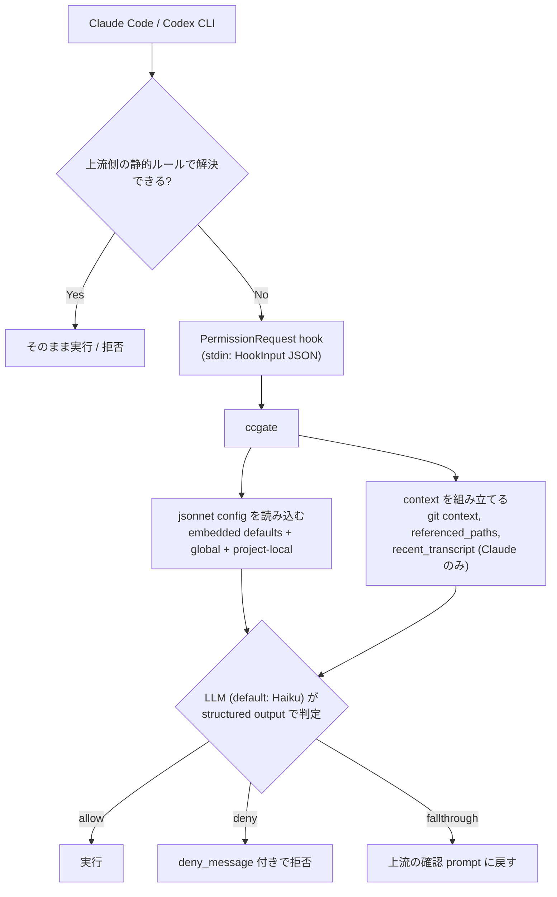

# ccgate

[](https://github.com/tak848/ccgate/actions/workflows/ci.yml)
[](https://github.com/tak848/ccgate/releases)

AI コーディングツール向けの **PermissionRequest** フックです。ツール実行の許可判定を LLM (Claude Haiku) に委任し、jsonnet 設定に書いたルールに基づいて allow / deny / fallthrough を返します。

ccgate は組み込みのデフォルトルールを持っているので、設定ファイルなしでも動きます。


対応ターゲット:

- **[Claude Code](https://docs.anthropic.com/en/docs/claude-code)**
- **[OpenAI Codex CLI](https://developers.openai.com/codex/hooks)**

[English README](../../README.md)

## インストール

### mise (推奨)

mise `2026.4.20` 以降が必要です。

```bash
mise use -g aqua:tak848/ccgate
```

ccgate をグローバルに登録せず一度だけ試したい場合 (`npx` / `uvx` 相当):

```bash
mise exec aqua:tak848/ccgate -- ccgate --version
```

### aqua

[aqua](https://aquaproj.github.io/) 標準 registry 経由 (registry `v4.498.0` 以降が必要)。aqua 管理下のプロジェクトで (`aqua.yaml` がない場合は `aqua init` を先に走らせる):

```bash
aqua g -i tak848/ccgate
aqua i
```

[グローバル aqua 設定](https://aquaproj.github.io/docs/tutorial/global-config) に入れる場合は aqua 公式チュートリアルに従ってください。

### go install

```bash
go install github.com/tak848/ccgate@latest
```

### GitHub Releases

[Releases](https://github.com/tak848/ccgate/releases) からバイナリをダウンロードし、PATH の通った場所に配置してください。

### Homebrew

```bash
brew install tak848/tap/ccgate
```

## クイックスタート — Claude Code

### 1. Claude Code の hooks に登録

`~/.claude/settings.json`:

```json
{
  "hooks": {
    "PermissionRequest": [
      {
        "matcher": "",
        "hooks": [
          {
            "type": "command",
            "command": "ccgate claude"
          }
        ]
      }
    ]
  }
}
```

`"command": "ccgate"` (subcommand なし) が Claude Code hook の正規呼び出し方法です。 `ccgate claude` はその明示形。

`ccgate` が PATH に通っていない場合は、hook の `command` を等価な呼び出し (例: `mise exec aqua:tak848/ccgate -- ccgate claude`) または絶対パスに書き換えてください。

### 2. API キー

ccgate は default で Anthropic の Claude Haiku を呼びます。 `CCGATE_ANTHROPIC_API_KEY` (`ANTHROPIC_API_KEY` でも可) を export してください。 OpenAI / Gemini に切り替える場合や、 各 provider の発行ページと環境変数の解決順は [docs/ja/providers.md#api-キー](providers.md#api-キー) を参照。

ここまでで ccgate は組み込みデフォルトで動き始めます。allow / deny を自分で書きたい場合は [docs/ja/rule-tuning.md](rule-tuning.md) を、ルールの仕組みを先に押さえたい場合は [コンセプト](#コンセプト) を参照してください。

## クイックスタート — Codex CLI

> [!NOTE]
> Codex hooks は `~/.codex/config.toml` に `[features] codex_hooks = true` の設定が必要です。詳細は [docs/codex-cli.md](codex-cli.md) を参照。

### 1. Codex hook として登録

Codex は `~/.codex/hooks.json` と `~/.codex/config.toml` から hook を読み込みます (project が trusted なら `<repo>/.codex/{hooks.json,config.toml}` も overlay)。好きな方で登録してください。

`~/.codex/hooks.json`:

```json
{
  "hooks": {
    "PermissionRequest": [
      {
        "matcher": "",
        "hooks": [
          {
            "type": "command",
            "command": "ccgate codex",
            "statusMessage": "ccgate evaluating request"
          }
        ]
      }
    ]
  }
}
```

`~/.codex/config.toml`:

```toml
[features]
codex_hooks = true   # Codex hooks はこの feature flag 配下にあり、互換性のため明示しておく

[[hooks.PermissionRequest]]
matcher = ""

[[hooks.PermissionRequest.hooks]]
type    = "command"
command = "ccgate codex"
statusMessage = "ccgate evaluating request"
```

lookup 順序、 project-local overlay、 in-tree dev build 用の `go run` レシピは [docs/codex-cli.md](codex-cli.md) を参照。

### 2. API キー

provider の API キーを export してください — [docs/ja/providers.md#api-キー](providers.md#api-キー) を参照。

ここまでで ccgate は組み込みデフォルトで動き始めます。allow / deny を自分で書きたい場合は [docs/ja/rule-tuning.md](rule-tuning.md) を、ルールの仕組みを先に押さえたい場合は [コンセプト](#コンセプト) を参照してください。

## コンセプト

ccgate の `allow` / `deny` / `environment` はいずれも **自然言語の文字列リスト**です。これらが system prompt に埋め込まれて LLM に送られ、LLM が `allow` / `deny` / `fallthrough` のいずれかを返します。jsonnet 側で deterministic にマッチする engine ではなく、すべての PermissionRequest が LLM を経由する設計です。

評価フロー:



ccgate が LLM に渡す情報 (代表項目):

- `tool_name`, `tool_input`, `tool_input_raw` (元の JSON payload をそのまま渡す)。
- `cwd`, `repo_root`, `branch_name`, worktree info (`gitutil.Context` から)。working tree の dirty/clean は **渡していない**。
- `referenced_paths` — `tool_input` から best-effort で抽出した path リスト。対象 tool は `Read` / `Write` / `Edit` / `MultiEdit` / `Glob` / `Grep` / `Bash` のみ。`apply_patch` (Codex) や MCP tool では空で、LLM は `tool_input_raw` の hunk / args を直接読む。
- Claude のみ: `permission_mode` (`"plan"` で system prompt が plan mode rule に切替), `permission_suggestions`, `recent_transcript`, `settings_permissions` hint (whitelist ではなく hint 扱い)。

target ごとの完全な入力一覧は [docs/claude-code.md](claude-code.md) / [docs/codex-cli.md](codex-cli.md) を参照してください。

## 設定

### 設定ファイルの読み込み順序

| 順序 | Claude Code | Codex CLI |
|----:|-------------|-----------|
| 1 | 組み込みデフォルト (常にベースとして適用) | 同じ |
| 2 | `~/.claude/ccgate.jsonnet` (グローバル) | `~/.codex/ccgate.jsonnet` |
| 3 | `{main_worktree}/.claude/ccgate.local.jsonnet` (linked worktree のときのみ、Git 未追跡のみ) | `{main_worktree}/.codex/ccgate.local.jsonnet` |
| 4 | `{repo_root}/.claude/ccgate.local.jsonnet` (Git 未追跡のみ) | `{repo_root}/.codex/ccgate.local.jsonnet` |

合成ルール (要点):

- **list (`allow` / `deny` / `environment`)**: 設定した layer が引き継ぎを **置換**。`append_*` は **末尾追加**。
- **スカラー (`log_*` / `metrics_*` / `fallthrough_strategy`)**: per-field 上書き。
- **`provider` block**: ブロック全体を atomic に置換 (フィールド単位 merge なし)。

プロジェクトローカル設定は **Git に追跡されていないファイルのみ** 読み込む。 `disable_load_main_worktree_local_config: true` を (1) / (2) に書けば (3) をスキップ ((3) / (4) に書いても無視)。 詳細・全フィールドリファレンスは [docs/configuration.md](configuration.md#ccgate-が-config-を探す場所) を参照。

## ルールチューニング

provider と hook の登録が済んでから、自分の `allow` / `deny` / `append_*` を書きたくなったらここから。

- **defaults を確認**: `ccgate claude init | less` / `ccgate codex init | less` (`-p` 付きで `.local.jsonnet` の雛形も出せる)。
- **どこに書く**: グローバル `~/.<target>/ccgate.jsonnet`、プロジェクトローカル `<repo>/.<target>/ccgate.local.jsonnet` (Git 未追跡のみ)。
- **置換 vs 追加**: 基本は `append_allow` / `append_deny` / `append_environment` (embedded defaults を残して自分のエントリを追加)。 `allow:` / `deny:` は完全置換 (defaults を捨てて自分の list だけが有効)。

書き方の典型例 (Claude / Codex 別の append_allow / append_deny / 完全置換)、`deny_message:` ヒントの形式、`std.native('env')` / `must_env` で env を埋め込む方法、`ccgate <target> metrics --details N` を使った iteration workflow、`fallthrough_strategy` を含むその他の細部は [docs/rule-tuning.md](rule-tuning.md) に集約してあります。

## Provider と credential

`provider.name` (+ 必要なら `model`) を任意の layer で書き換えると provider を切り替えられます:

```jsonnet
{
  provider: {
    name: 'openai',
    model: '<openai model name>',  // model 選定は docs/ja/providers.md 参照
  },
}
```

対応する API キーは [docs/ja/providers.md#api-キー](providers.md#api-キー) を参照して export してください。 キーが見つからない場合 ccgate は上流ツールの確認画面に fallthrough するので、 provider 切替で hook が壊れることはありません。

provider の切替手順、 モデル選定時の確認事項、 API キーの解決順、 互換 proxy 経由での利用は [docs/ja/providers.md](providers.md) にまとめてあります。

**Refresh される credential** (AWS STS / Vertex ADC / OpenAI 互換 gateway の virtual key / 社内 key broker など、 静的 env では追従できないケース) を扱いたいときは `provider.auth` を設定します。 3 形式から選びます:

- `type=exec` — ccgate が **credential helper** コマンドを実行し、 stdout を credential として使う (`expires_at` を keyed cache)。
- `type=file` — 外部 rotator が書いた credential file を ccgate が読む。
- `type=profile` — Anthropic 専用。 `ant auth login` の profile を SDK に渡し、 SDK の refresh-token loop が credential を保有する。

helper 契約・キャッシュ・401/403 挙動・復旧手順を含む完全な仕様は [docs/ja/api-key-helper.md](api-key-helper.md) を参照。

## Fallthrough strategy

LLM が判定に自信を持てないと `fallthrough` を返し、上流ツールの確認画面にフォールバックします。これは対話セッションでは妥当ですが、スケジューラ / ボット等の無人実行では処理が止まります。 `fallthrough_strategy` を設定すれば LLM の迷いを `allow` / `deny` に強制変換できます (default は `ask`):

```jsonnet
{ fallthrough_strategy: 'deny' }  // 安全側: 迷ったら拒否。無人実行ではこちらを推奨
```

`allow` は LLM が迷った操作を無条件に通すので使う場面は限定されます。値の意味、対象外となるケース (API 応答打ち切り、API キー欠損、`bypassPermissions` / `dontAsk`、ユーザー対話 tool 等)、 metrics による監査は [docs/ja/configuration.md](configuration.md) を参照。

## ログとメトリクス

- ログ: `$XDG_STATE_HOME/ccgate/<target>/ccgate.log` (未設定なら `~/.local/state/ccgate/<target>/`)
- メトリクス: `$XDG_STATE_HOME/ccgate/<target>/metrics.jsonl`
- 両ファイルとも `_max_size` 閾値でローテーション。

```bash
ccgate claude metrics                 # 直近 7 日、TTY テーブル
ccgate claude metrics --details 5     # fallthrough / deny の上位 5 コマンドをドリルダウン
ccgate codex  metrics --json          # JSON 出力 (機械可読)
```

列の意味、JSON エントリ schema、credential 障害集計は [docs/ja/configuration.md#メトリクス出力](configuration.md#メトリクス出力) を参照。

## 既知の制約

- **Plan mode の正しさはプロンプトのみに依存 (Claude のみ)**: `permission_mode == "plan"` では、(a) 実装系 write の拒絶と (b) allow guidance に載っていない read-only クエリの許可、両方を LLM とシステムプロンプトに委ねている。どちらにも誤判定の余地あり。
- **embedded default の特定ルールだけの部分削除は不可**: layer は list を **完全置換** (`allow: [...]`) するか **末尾追加** (`append_allow: [...]`) するかのどちらかで、1 件除外したい場合は残りを `allow:` / `deny:` に書き直す。
- **jsonnet 側に runtime conditional logic なし**: jsonnet 評価は hook 発火ごとの config load 時に、 ccgate が `tool_input` を見る前に実行される。 `tool_input` / git working tree state に基づく runtime 分岐は書けない (分類は LLM の仕事)。 config 評価時の env 読み込みのみ `std.native('env')(name)` / `std.native('must_env')(name)` で可能。

## Claude Code plugin

ccgate は本リポジトリに Claude Code plugin を同梱しています。上のドキュメントを背景に、 Claude Code から AI に作業を任せられます。

インストール:

```text
/plugin marketplace add tak848/ccgate
/plugin install ccgate@tak848-ccgate
```

Skills (Claude が auto-dispatch する。 manual invocation も可):

| Skill | 役割 |
|---|---|
| `/ccgate:setup`  | 初回 install、 PermissionRequest hook 登録、 provider 設定の対話的ガイド。 |
| `/ccgate:tune`   | 直近の `ccgate <target> metrics --details N` から `append_allow` / `append_deny` 編集を提案。 |
| `/ccgate:debug`  | ccgate の判定 (deny / fallthrough / 401 / plan-mode) の root cause を説明。 |
| `/ccgate:doctor` | binary、 version、 hook 登録、 config layer、 provider 設定の read-only audit。 |

> [!NOTE]
> dotfile を編集する skill (`setup`、 `tune`) は Claude Code が plan mode の間は diff の提示までで停止します。 plan mode を抜けてから write を実行してください。

## ドキュメント

- [providers.md](providers.md) — Provider 切替、 API キー、 base_url、 互換 proxy
- [rule-tuning.md](rule-tuning.md) — ルールチューニングの入り口 (defaults 確認、 append vs 置換、 3 パターン例、 iteration workflow)
- [configuration.md](configuration.md) — 設定 layering、 全フィールド reference、 fallthrough_strategy 詳細、 メトリクス出力
- [api-key-helper.md](api-key-helper.md) — `provider.auth` リファレンス (helper の契約、 キャッシュ、 401/403 挙動、 復旧手順)
- [claude-code.md](claude-code.md) — Claude Code 固有の HookInput
- [codex-cli.md](codex-cli.md) — Codex CLI 固有の HookInput
- [English README](../../README.md)

## CLI リファレンス

```
ccgate                                       stdin から HookInput JSON を読み込む (Claude Code hook)。`ccgate claude` と等価。
ccgate claude                                bare ccgate と等価 (新規ユーザー向け推奨表記)
ccgate claude init [-p] [-o FILE] [-f]       Claude Code 用の埋込デフォルトを出力
ccgate claude metrics [...]                  Claude Code のメトリクス集計
ccgate codex                                 stdin から HookInput JSON を読み込む (Codex CLI hook)
ccgate codex init [-p] [-o FILE] [-f]        Codex CLI 用の埋込デフォルトを出力
ccgate codex metrics [...]                   Codex CLI のメトリクス集計
```

top-level の `ccgate init` / `ccgate metrics` は実 subcommand ではなく、 per-target 形式への 1 行案内を出して exit `2` します。

## 開発

```bash
mise run build    # バイナリビルド
mise run test     # テスト実行
mise run vet      # go vet
mise run schema   # schemas/{claude,codex}.schema.json を再生成
```

## 関連記事

- 日本語 (Zenn): <https://zenn.dev/layerx/articles/20260428-ccgate>
- English (dev.to): <https://dev.to/tak848/ccgate-delegate-claude-code-codex-cli-permission-prompts-to-an-llm-274c>

## ライセンス

MIT
